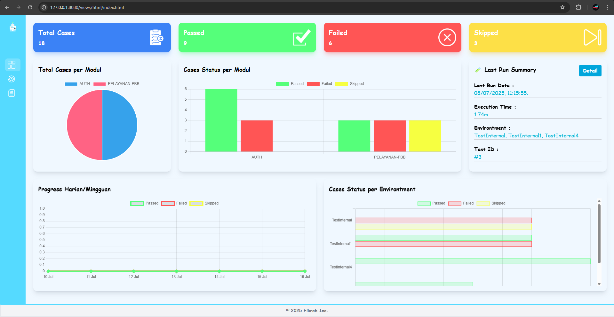
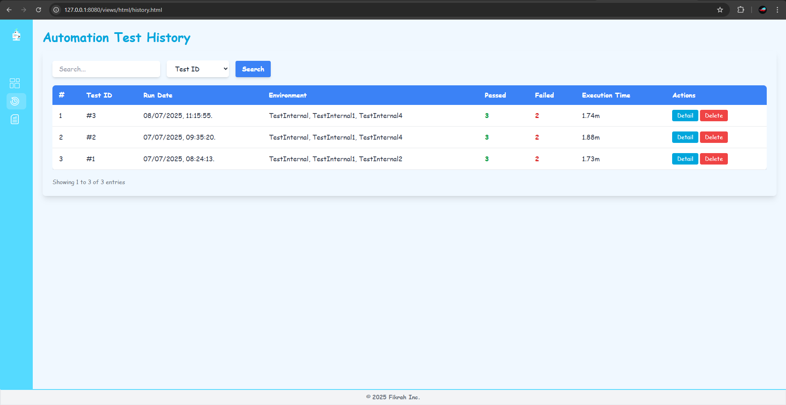
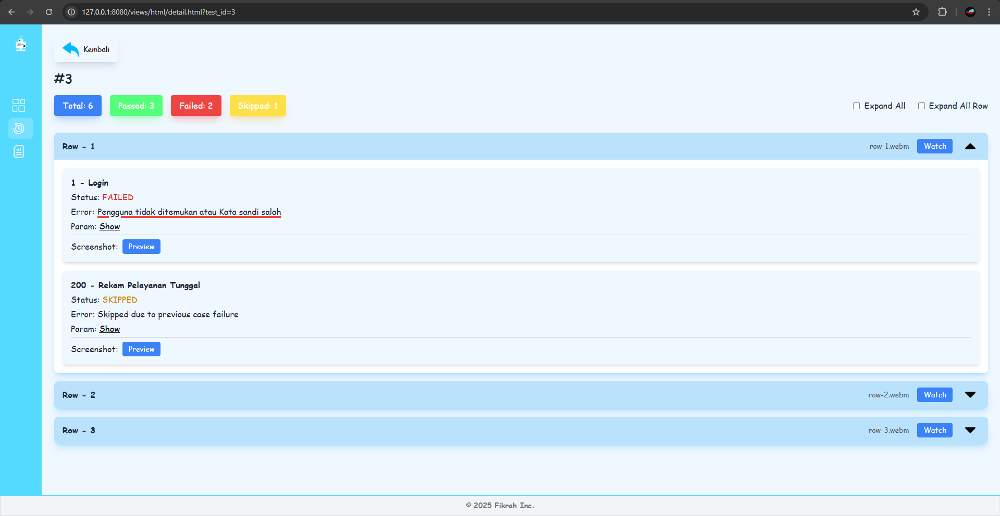
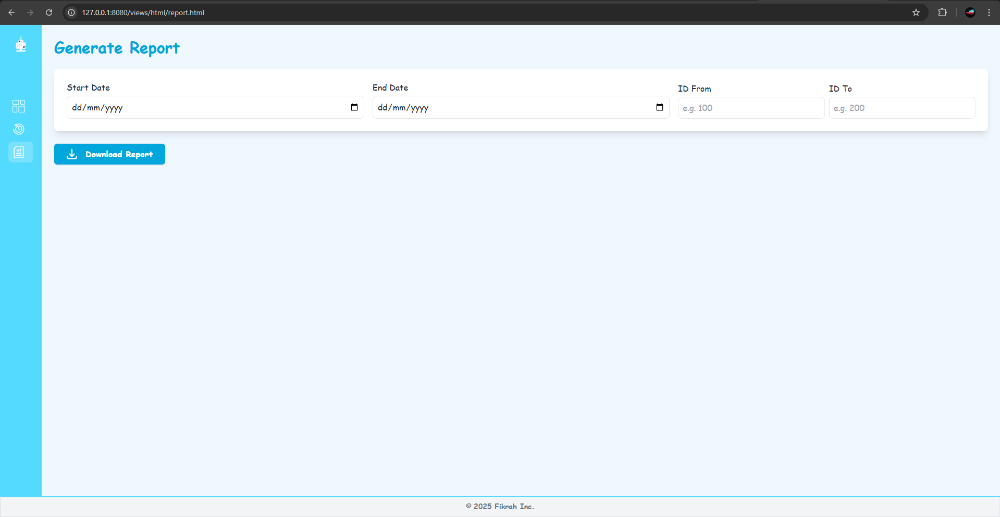

<p>
  
</p>

# Auto Report

A web-based dashboard for viewing and managing automation test results.  
This project helps visualize test execution details such as passed/failed/skipped tests, includes error messages, screenshots, videos, and supports report export in document format.

## Features

- Summary of test results (Total, Passed, Failed, Skipped)
- Test detail view per row
- Error messages, screenshots, and video playback
- Clean and Fun UI using modern web design
- Integrated with Playwright (or your preferred automation tool)
- Document report generation (DOC format)

## Project Structure
```
automation-report/
|-api/ # Backend API (Express or similar)
|-assets/ # Static assets
|-exports/ # Temp report (After generating report)
|-reports/ # Saving report files like screenshot, videos, etc
|-views/ # Frontend HTML/CSS/JS files/folder
```

## Tech Stack

- **Frontend**: HTML, CSS, JavaScript
- **Backend**: Node.js, Express.js
- **Database**: SQLite
- **Test Automation**: Playwright
- **Styling**: Tailwind CSS (optional)
- **Others**: Live Server, fs-extra

## How to Run

### 1. Clone the repo
```bash
git clone https://github.com/username/automation-report.git
cd automation-report
```

### 2. Install Dependencies
```bash
npm install
```

### 3. Run Application
```bash
npm run report (This will launch both the backend API and frontend using Live Server.)
```

### 4. Alternative (Manual Run Application)

```bash
# Run backend API
cd api
node server.js

# Run frontend
cd ../views/html
npx live-server
```

## 🧙‍♂️ Author

- Fikrah – [@Kyzune](https://github.com/Kyzune)

## 📸 Screenshots

# Dashboard

# Test History

# Test Detail

# Generate Report

